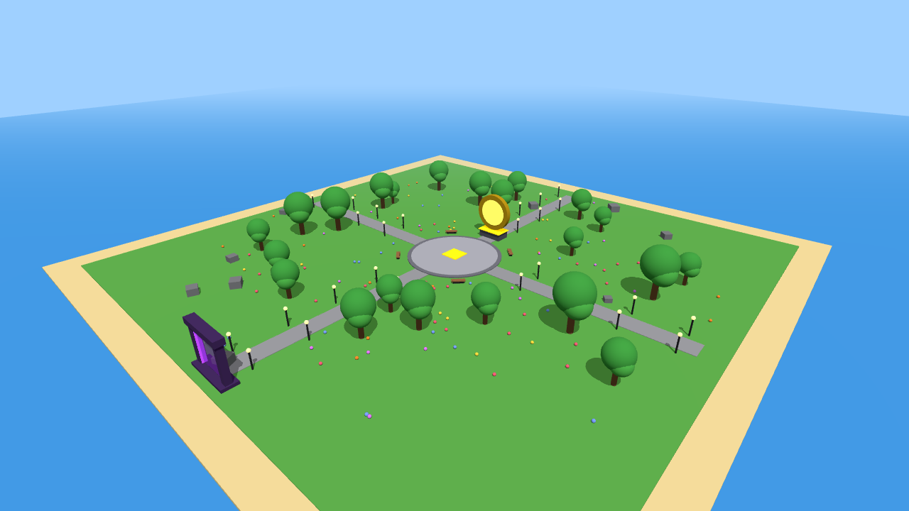

# Click Simulator (Roblox)

A simple "simulator" game, one of the most popular kinds of game on Roblox:

- **Click** the big button to get coins (with a bounce and "+10" popups)
- **Upgrade** to get more coins per click
- **Rebirth** to reset your coins for a permanent coin multiplier
- **Coins all over the island**: walk into them to collect bonus coins (they spin and respawn)
- **Rebirth portal**: walk into the purple portal to rebirth
- **2 Game Passes** sold for Robux (this is how you earn): **2x Coins** and **Auto Clicker** (2 free clicks every second)
- **Sounds and messages** like "Not enough coins!" and "+50 💰"
- **Leaderboard** in the top right, and **saves progress** automatically
- **Island map** with a stone plaza, a giant spinning gold coin, trees, lamp posts, flowers, benches, a glowing rebirth portal, and bright simulator-style lighting



*(Preview render of the map. In Roblox it also has glowing lamps, sparkles, and the "CLICK SIMULATOR" title floating above the coin.)*

The GUI is made by code, so you don't have to build any buttons.

## Fastest setup: open the ready-made place file

1. Download [`ClickSimulator.rbxlx`](ClickSimulator.rbxlx) (on GitHub, open the file and click the **Download raw file** button).
2. In Roblox Studio, go to **File → Open from File** and pick `ClickSimulator.rbxlx`.
3. Press **Play**. Then follow "Publish it" below.

If you change the scripts, rebuild the place file with `python3 tools/build_place.py`.

## Manual setup (about 5 minutes)

1. Open **Roblox Studio** and pick the **Baseplate** template.
2. In the **Explorer**, right-click **ServerScriptService** and choose **Insert Object**, then **Script**.
   Delete what's in it and paste everything from [`ServerScriptService/GameServer.server.lua`](ServerScriptService/GameServer.server.lua).
3. Open **StarterPlayer**, right-click **StarterPlayerScripts** and choose **Insert Object**, then **LocalScript**.
   Paste everything from [`StarterPlayerScripts/GameClient.client.lua`](StarterPlayerScripts/GameClient.client.lua).
4. Press **Play** to test it.

The manual setup gives you the game on a plain baseplate. The island map only comes with the place file above.
To get it anyway, open `ClickSimulator.rbxlx` once and copy the **Map** model from its Workspace into your game.
Also add [`ServerScriptService/MapEffects.server.lua`](ServerScriptService/MapEffects.server.lua) as another Script for the lighting and effects.

## Publish it and turn on saving

1. Go to **File → Publish to Roblox**, then give it a name and description.
2. Go to **Home → Game Settings → Security** and turn on **Enable Studio Access to API Services**. Saving needs this.
3. Go to **Game Settings → Permissions** and set the game to **Public**.

## Make Robux (the 2 Game Passes)

Do this once for **"2x Coins"** and once for **"Auto Clicker"**:

1. Go to [create.roblox.com](https://create.roblox.com), open your game, then **Monetization → Passes → Create a Pass**.
   Give it the name, upload an icon, and save it.
2. Open the pass, turn on **Item for Sale**, and set a price.
   About 99 Robux for 2x Coins and 149 for Auto Clicker is typical.
3. Copy the pass's **ID** (the number in its URL).
4. Open the **GameServer** script in ServerScriptService and put the IDs in these lines at the top:
   ```lua
   local DOUBLE_COINS_GAMEPASS_ID = 0
   local AUTO_CLICKER_GAMEPASS_ID = 0
   ```
   For example, `= 123456789`. Then publish again.
   The **⭐ 2x COINS ⭐** and **🤖 AUTO CLICKER** buttons appear in-game after you add the IDs.

## Easy tweaks

At the top of the server script:

| Setting | What it does |
|---|---|
| `BASE_UPGRADE_COST` | Price of the first upgrade |
| `UPGRADE_COST_GROWTH` | How much pricier each upgrade gets |
| `BASE_REBIRTH_COST` | Coins needed to rebirth (goes up each time) |
| `CLICK_COOLDOWN` | Limits auto-clickers |
| `AUTO_CLICKS_PER_SECOND` | How strong the Auto Clicker pass is |
| `MAX_MAP_COINS` | How many coins lie around the island |
| `MAP_COIN_CLICKS` | How much a map coin is worth (in clicks) |

## Tips to get players

- A bright, exciting **thumbnail and icon** matter more than anything else.
- Use a clear name, such as "Click Simulator 🔥 [UPDATE]".
- Add some free models from the **Toolbox** (trees, a lobby, or a spawn area) so the map isn't empty.
- Keep updating the game, because Roblox favors games that people return to.
- Roblox has a lot of competition, so earning Robux isn't guaranteed. Treat your first game as practice and keep improving it.
